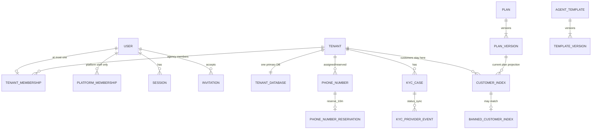
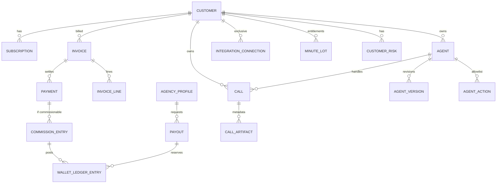

# Vokit Database Design

**SoT entities:** SRS §23  
**Physical topology:** ADR-001 / ADR-003  
**Decided questions:** Q-001–Q-006, Q-010–Q-012

## 1. Topology

| Database | Multiplicity | Contents |
|---|---|---|
| Control-plane MySQL | 1 | Identity, tenancy registry, plans, number inventory, audit, KYC status/provider refs, fraud/ban index, processor event inbox, cross-tenant projections |
| Agency tenant MySQL | 1 per Agency | Agency operating data, customers currently or historically written here, agents, calls, invoices, ledger, integrations |
| Recording object store | 1 logical plane | Raw audio / voicemail; no SQL rows for bytes |
| Qdrant | 1 cluster, payload-isolated | Knowledge chunks |

There is no shared “default tenant” database.

## 2. Identity rules

- `tenant_id` is immutable and equals the Agency ID for V1 physical tenancy.
- `database_id` is immutable and independent of database *name* if renamed operationally.
- `customer_id` is globally unique and lives in the control-plane customer index.
- Primary keys: UUID v7 (ADR-004 proposed).
- Foreign keys **do not span** tenant databases.
- Cross-DB references use identifiers only, resolved through the control plane.

## 3. Control-plane tables (logical)

### 3.1 Identity

| Table | Purpose |
|---|---|
| `users` | Global login identity: email unique platform-wide (Q-001 option A/B hybrid: unique email, single membership) |
| `user_credentials` | Password hash / MFA refs |
| `sessions` | Server sessions; revoke on disable |
| `platform_memberships` | Super Admin / Finance / Support / KYC roles; `tenant_id` null |
| `tenant_memberships` | Exactly one row per tenant user: `principal_type=agency\|customer`, `tenant_id`, optional `customer_id` |
| `roles` | Scoped role definitions (`platform` / `agency` / `customer`) |
| `role_permissions` | Permission grants |
| `invitations` | Invite lifecycle |

Invariant: a user has **either** platform memberships **or** one tenant membership, never both.

### 3.2 Tenancy registry

| Table | Purpose |
|---|---|
| `tenants` | `tenant_id`, agency display/legal projection, status, capabilities, commission_rate current, currency=USD |
| `tenant_databases` | `database_id`, host, port, name, TLS/cert ref, secret ref, status, schema_version, health, region |
| `tenant_provisioning_jobs` | Resumable saga state |
| `tenant_migration_jobs` | Per-tenant version lock, canary, retry |

Secrets are references, never plaintext passwords.

### 3.3 Platform catalog and inventory

| Table | Purpose |
|---|---|
| `plans` / `plan_versions` | Immutable commercial terms once used |
| `phone_numbers` | Platform-owned inventory, provider ref, E.164, state, cost, assignment |
| `phone_number_reservations` | Agency reservation, expires at +10 minutes |
| `agent_templates` / `template_versions` | Global/selected-agency visibility |
| `global_instructions` | Mandatory safety layer |
| `global_knowledge_sources` | Platform knowledge metadata |

### 3.4 Cross-tenant indexes (approved)

| Table | Purpose |
|---|---|
| `customer_index` | `customer_id`, `current_tenant_id` (creating/owning agency; no move in initial V1), status, plan/risk projections, created_at |
| `banned_customer_index` | Fraud keys for re-onboarding prevention; do not expose match logic |
| `call_index` | Optional operational index: `call_id`, tenant_id, customer_id, started_at — no audio |
| `payout_index` | Super Admin payout queue projection |
| `kyc_cases` | Agency KYC status mapped from provider; provider session/inquiry refs; last event ID; non-sensitive reason codes |
| `kyc_provider_events` | Provider webhook event ID, processing status (no document bytes) |
| `payment_processor_events` | Event ID, processor, payload metadata, processing status |
| `audit_events` | Immutable audit |

### 3.5 What Super Admin reads

Super Admin dashboards use **control-plane projections** and, only when authorized, explicit privileged tenant traversal. Normal request paths never `JOIN` across tenant databases and never “search all DBs until found.”

## 4. Tenant-plane tables (logical, per Agency DB)

Every tenant-owned row that is customer-scoped stores both `tenant_id` (or implicit by DB) and `customer_id` (TEN-002).

Recommended groups:

**Agency**

- `agency_profile`
- `agency_capabilities` (or columns on profile)
- `payout_methods`
- `commission_entries`
- `wallet_ledger_entries`
- `payouts` (receipt_ref; **no** private proof bytes)
- `agency_knowledge_sources`
- `agency_users_projection` (optional; identity remains control-plane)

**Customer**

- `customers` (current and, if historically present, closed/moved markers)
- `subscriptions`
- `invoices` / `invoice_lines`
- `payments`
- `minute_lots` (included / top-up / overage usage allocation)
- `minute_usage_ledger`
- `customer_risk` (status, verification state)
- `customer_verification_files` (refs only)
- `customer_knowledge_sources`
- `integration_connections` (owner = this customer only)
- `webhook_endpoints` / `webhook_deliveries`

**Agents / telephony assignment / calls**

- `agents` / `agent_versions` / `agent_actions`
- `transfer_destinations` / `transfer_rules`
- `number_assignments` (pointer to control-plane `phone_number_id`)
- `calls`
- `call_events`
- `call_artifacts` (metadata + object ref + checksum + retention)
- `call_actions`

## 5. Financial design

- Monetary columns: `BIGINT` minor units + `currency CHAR(3)` = `USD`.
- No floating-point money.
- Ledger entries are insert-only.
- Cached wallet buckets are projections that can be rebuilt.
- `commission_entries` store `eligible_base_minor`, `rate_bps` or decimal snapshot, `amount_minor`, `earned_at`, `available_at`, `state`.
- Refunds/chargebacks insert compensating entries; they do not update historical earning rows in place.
- Initial V1: customer invoices always live in the owning Agency DB (Q-016). Do not implement destination/source split until reassignment is scheduled.

## 6. Minutes design (Q-003)

`minute_lots`

- `lot_type`: `included` | `top_up` | `overage`
- `seconds_granted`, `seconds_consumed`
- `cycle_id` / `invoice_id`
- `expires_at` if applicable

Drain order: included → top-up → overage if plan allows.

Call admission reads remaining seconds + plan hard-stop/overage + grace policy.  
Mid-call exhaustion: overage if enabled; else grace; then end.

## 7. Phone numbers (Q-002)

Control plane owns inventory.

States (TEL-009): Pending, Active, Failed, Releasing, Released, plus reservation.

Reservation:

- Agency selects a number
- Row locked until `now + 10 minutes`
- Another agency cannot reserve/purchase it
- On assign-to-agent: customer becomes the billed party; create invoice/entitlement in that customer’s **current** Agency DB

## 8. Migrations

Two tracks:

1. Control-plane Django migrations — normal, single DB.
2. Tenant schema migrations — versioned jobs:
   - preflight health
   - per-tenant lock
   - expand / backfill / verify
   - canary tenants first
   - bounded concurrency
   - never assume all tenant DBs are online

## 9. Backup / restore

- Control plane and each tenant DB are independently restorable.
- Restoring Agency A must not require Agency B.
- Recording objects restore separately and reconcile by checksum.
- Test restore before production (NFR-007).

## 10. Fail-closed rules

| Condition | Behavior |
|---|---|
| Missing tenant mapping | Deny |
| Missing credentials | Deny |
| Unhealthy DB | Fail closed for writes; reads only if an explicit design exists (V1: fail closed) |
| Cross-tenant handle detected | Terminate + security telemetry |
| Lookup failure | Never try other tenant DBs |

## 11. Proposed vs locked

Locked by SRS / OPEN-QUESTIONS / ADR-001–003 and 005 (once accepted): ownership, USD, minutes, reservation, customer-under-agency, exclusive customer integrations, external KYC.

Proposed by ADR-004: UUID v7, table naming, MySQL 8, Celery-backed migration jobs.

Do not invent extra entities that change commission, tenancy, or recording rules.

## 12. ERD — control plane

## 13. ERD — Agency tenant database

State machines remain in SRS §24. Soft-delete of financial/KYC/audit rows remains TEN-006.
